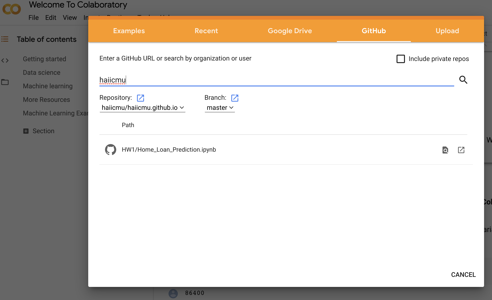

# Assignment 1

The goal of assignment #1 is to get some hands-on experience working
with data about human activity and some simple machine learning.

## PART A: SETUP
*If you already have a working Python 3 & Jupyter notebook installation
and are familiar with them, feel free to skip this part.*

- Option 1: Local installation
  [instruction](https://github.com/haiicmu/haiicmu.github.io/tree/master/HW1).
- Option 2: You can also use Google’s cloud-hosted Jupyter notebooks,
called [Colab](https://colab.research.google.com/).

By clicking on the [Colab](https://colab.research.google.com/) link,
you should be prompted to open a notebook. You can also click on
"File" and select "Open notebook." You can select "GitHub" and search "haiicmu", which should show
you the following image: 

Note: When you are reading data in our notebook, you need to copy the
“data” folder to some place you can access from Colab. See this [blog
post](https://medium.com/@simonprdhm/2-ways-to-upload-csv-files-to-google-colab-4d29ffa9db85)
or other online resources for how to do this.

## PART B: PREDICTING LOAN APPROVAL
Open the notebook `Home_Loan_Prediction.ipynb` and data in the [GitHub
Link](https://github.com/haiicmu/haiicmu.github.io/tree/master/HW1),
and complete the questions within the notebook.

## SUBMITTING HOMEWORK
Download just your notebook file and submit on canvas.
